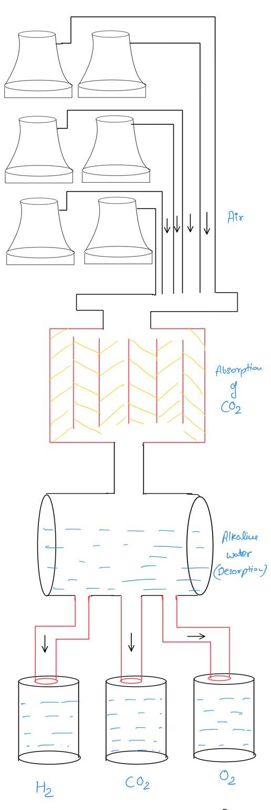
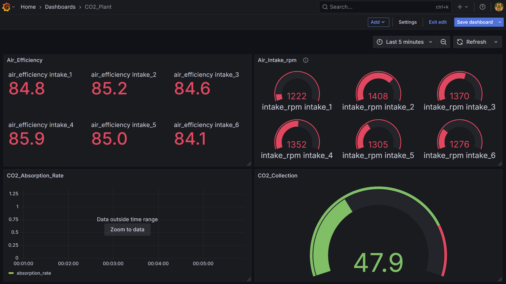

# Time-Series-Analysis

# 🌿 CO₂ Capture Plant: Real-Time Monitoring, Forecasting & Optimization

This project simulates, monitors, forecasts, and optimizes the operations of a CO₂ capture plant using Python, InfluxDB, Grafana, and machine learning.



---

## 📦 Project Features

- 🔄 Real-time simulation of plant data (air intake, absorption, desorption, tank output)
- 📈 Visualization with Grafana dashboards
- 🧠 Forecasting CO₂ levels using Prophet
- 🤖 Optimization of process parameters to maximize CO₂ output
- 📤 Data export from InfluxDB to CSV for analysis
- 🧩 Modbus-ready integration for real-world sensor data


---

## 🖼️ Dashboard Preview

This real-time Grafana dashboard visualizes sensor data across all plant units — including air intake, CO₂ absorption, desorption, and output tanks.  
It also supports alerts, gauge views, and historical trends across multiple units.

---


---

## ⚙️ Architecture Overview

```mermaid
graph TD
  A[Python Simulator ] --> B[InfluxDB]
  B --> C[Grafana Dashboard]
  B --> D[CSV Export]
  D --> E[ML Forecasting + Optimization]


